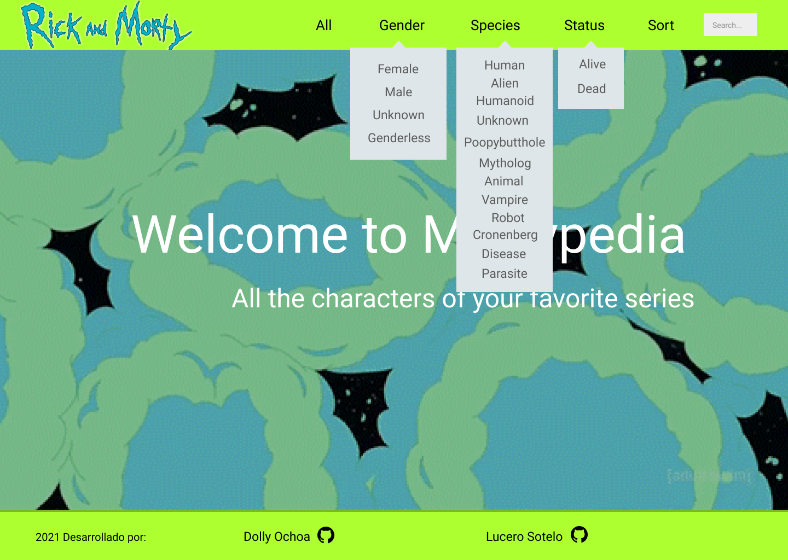
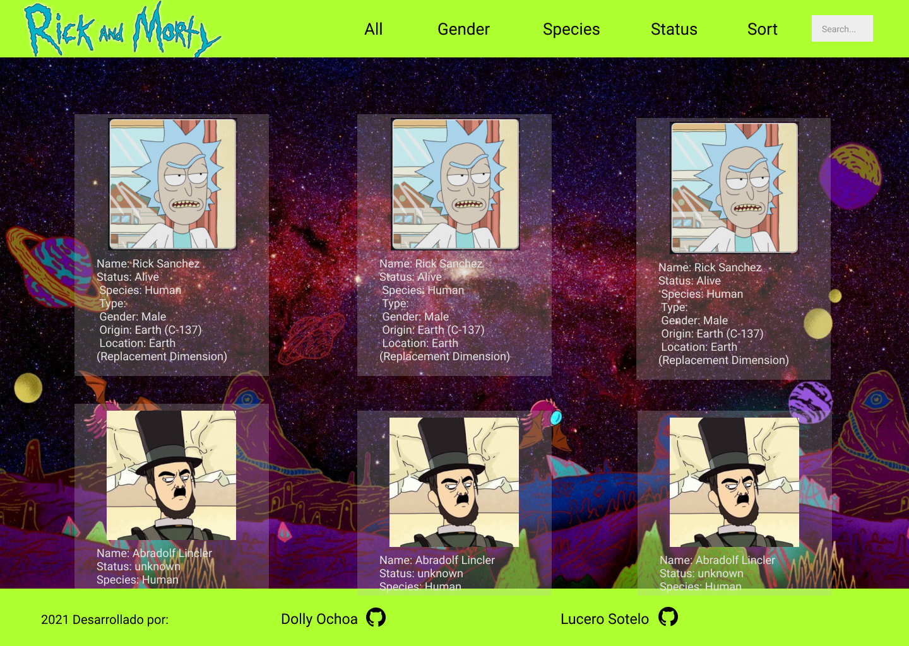

# Data Lovers

## 1. Preámbulo

Según [Forbes](https://www.forbes.com/sites/bernardmarr/2018/05/21/how-much-data-do-we-create-every-day-the-mind-blowing-stats-everyone-should-read),
el 90% de la data que existe hoy ha sido creada durante los últimos dos años.
Cada día generamos 2.5 millones de terabytes de datos, una cifra sin
precedentes.

No obstante, los datos por sí mismos son de poca utilidad. Para que esas
grandes cantidades de datos se conviertan en **información** fácil de leer para
los usuarios, necesitamos entender y procesar estos datos. Una manera simple de
hacerlo es creando _interfaces_ y _visualizaciones_.

En la siguiente imagen, podrás ver cómo con la data que que se ve en la parte
izquierda se puede construir una interfaz amigable y entendible por el usuario
al lado derecho.

## 2. Resumen del proyecto

En este proyecto se construyó una _página web_ para visualizar un
_conjunto (set) de datos_**, filtrandola y ordenandola.

Esta es la data utilizada:

* [Rick and Morty](src/data/rickandmorty/rickandmorty.json).
  Este set nos proporciona la lista de los personajes de la serie Rick and
  Morty. [API Rick and Morty](https://rickandmortyapi.com).
  - [Investigación con seguidores de Rick and Morty](src/data/rickandmorty/README.md)

## 3. Objetivos de aprendizaje

### HTML

- [ ] **Uso de HTML semántico**

  

Links

  * [HTML semántico](https://curriculum.laboratoria.la/es/topics/html/02-html5/02-semantic-html)
  * [Semantics - MDN Web Docs Glossary](https://developer.mozilla.org/en-US/docs/Glossary/Semantics#Semantics_in_HTML)

### CSS

- [ ] **Uso de selectores de CSS**

  

Links

  * [Intro a CSS](https://curriculum.laboratoria.la/es/topics/css/01-css/01-intro-css)
  * [CSS Selectors - MDN](https://developer.mozilla.org/es/docs/Web/CSS/CSS_Selectors)

- [ ] **Modelo de caja (box model): borde, margen, padding**

  

Links

  * [Box Model & Display](https://curriculum.laboratoria.la/es/topics/css/01-css/02-boxmodel-and-display)
  * [The box model - MDN](https://developer.mozilla.org/en-US/docs/Learn/CSS/Building_blocks/The_box_model)
  * [Introduction to the CSS box model - MDN](https://developer.mozilla.org/en-US/docs/Web/CSS/CSS_Box_Model/Introduction_to_the_CSS_box_model)
  * [CSS display - MDN](https://developer.mozilla.org/pt-BR/docs/Web/CSS/display)
  * [display - CSS Tricks](https://css-tricks.com/almanac/properties/d/display/)

- [ ] **Uso de flexbox en CSS**

  

Links

  * [A Complete Guide to Flexbox - CSS Tricks](https://css-tricks.com/snippets/css/a-guide-to-flexbox/)
  * [Flexbox Froggy](https://flexboxfroggy.com/#es)
  * [Flexbox - MDN](https://developer.mozilla.org/en-US/docs/Learn/CSS/CSS_layout/Flexbox)

### Web APIs

- [ ] **Uso de selectores del DOM**

  

Links

  * [Manipulación del DOM](https://curriculum.laboratoria.la/es/topics/browser/02-dom/03-1-dom-methods-selection)
  * [Introducción al DOM - MDN](https://developer.mozilla.org/es/docs/Web/API/Document_Object_Model/Introduction)
  * [Localizando elementos DOM usando selectores - MDN](https://developer.mozilla.org/es/docs/Web/API/Document_object_model/Locating_DOM_elements_using_selectors)

- [ ] **Manejo de eventos del DOM (listeners, propagación, delegación)**

  

Links

  * [Introducción a eventos - MDN](https://developer.mozilla.org/es/docs/Learn/JavaScript/Building_blocks/Events)
  * [EventTarget.addEventListener() - MDN](https://developer.mozilla.org/es/docs/Web/API/EventTarget/addEventListener)
  * [EventTarget.removeEventListener() - MDN](https://developer.mozilla.org/es/docs/Web/API/EventTarget/removeEventListener)
  * [El objeto Event](https://developer.mozilla.org/es/docs/Web/API/Event)

- [ ] **Manipulación dinámica del DOM**

  

Links

  * [Introducción al DOM](https://developer.mozilla.org/es/docs/Web/API/Document_Object_Model/Introduction)
  * [Node.appendChild() - MDN](https://developer.mozilla.org/es/docs/Web/API/Node/appendChild)
  * [Document.createElement() - MDN](https://developer.mozilla.org/es/docs/Web/API/Document/createElement)
  * [Document.createTextNode()](https://developer.mozilla.org/es/docs/Web/API/Document/createTextNode)
  * [Element.innerHTML - MDN](https://developer.mozilla.org/es/docs/Web/API/Element/innerHTML)
  * [Node.textContent - MDN](https://developer.mozilla.org/es/docs/Web/API/Node/textContent)

### JavaScript

- [ ] **Diferenciar entre tipos de datos primitivos y no primitivos**

- [ ] **Arrays (arreglos)**

  

Links

  * [Arreglos](https://curriculum.laboratoria.la/es/topics/javascript/04-arrays)
  * [Array - MDN](https://developer.mozilla.org/es/docs/Web/JavaScript/Reference/Global_Objects/Array/)
  * [Array.prototype.sort() - MDN](https://developer.mozilla.org/es/docs/Web/JavaScript/Reference/Global_Objects/Array/sort)
  * [Array.prototype.forEach() - MDN](https://developer.mozilla.org/es/docs/Web/JavaScript/Reference/Global_Objects/Array/forEach)
  * [Array.prototype.map() - MDN](https://developer.mozilla.org/es/docs/Web/JavaScript/Reference/Global_Objects/Array/map)
  * [Array.prototype.filter() - MDN](https://developer.mozilla.org/es/docs/Web/JavaScript/Reference/Global_Objects/Array/filter)
  * [Array.prototype.reduce() - MDN](https://developer.mozilla.org/es/docs/Web/JavaScript/Reference/Global_Objects/Array/Reduce)

- [ ] **Objetos (key, value)**

  

Links

  * [Objetos en JavaScript](https://curriculum.laboratoria.la/es/topics/javascript/05-objects/01-objects)

- [ ] **Variables (declaración, asignación, ámbito)**

  

Links

  * [Valores, tipos de datos y operadores](https://curriculum.laboratoria.la/es/topics/javascript/01-basics/01-values-variables-and-types)
  * [Variables](https://curriculum.laboratoria.la/es/topics/javascript/01-basics/02-variables)

- [ ] **Uso de condicionales (if-else, switch, operador ternario, lógica booleana)**

  

Links

  * [Estructuras condicionales y repetitivas](https://curriculum.laboratoria.la/es/topics/javascript/02-flow-control/01-conditionals-and-loops)
  * [Tomando decisiones en tu código — condicionales - MDN](https://developer.mozilla.org/es/docs/Learn/JavaScript/Building_blocks/conditionals)

- [ ] **Uso de bucles/ciclos (while, for, for..of)**

  

Links

  * [Bucles (Loops)](https://curriculum.laboratoria.la/es/topics/javascript/02-flow-control/02-loops)
  * [Bucles e iteración - MDN](https://developer.mozilla.org/es/docs/Web/JavaScript/Guide/Loops_and_iteration)

- [ ] **Funciones (params, args, return)**

  

Links

  * [Funciones (control de flujo)](https://curriculum.laboratoria.la/es/topics/javascript/02-flow-control/03-functions)
  * [Funciones clásicas](https://curriculum.laboratoria.la/es/topics/javascript/03-functions/01-classic)
  * [Arrow Functions](https://curriculum.laboratoria.la/es/topics/javascript/03-functions/02-arrow)
  * [Funciones — bloques de código reutilizables - MDN](https://developer.mozilla.org/es/docs/Learn/JavaScript/Building_blocks/Functions)

- [ ] **Pruebas unitarias (unit tests)**

  

Links

  * [Empezando con Jest - Documentación oficial](https://jestjs.io/docs/es-ES/getting-started)

- [ ] **Módulos de ECMAScript (ES Modules)**

  

Links

  * [import - MDN](https://developer.mozilla.org/es/docs/Web/JavaScript/Reference/Statements/import)
  * [export - MDN](https://developer.mozilla.org/es/docs/Web/JavaScript/Reference/Statements/export)

- [ ] **Uso de linter (ESLINT)**

- [ ] **Uso de identificadores descriptivos (Nomenclatura y Semántica)**

- [ ] **Diferenciar entre expresiones (expressions) y sentencias (statements)**

### Control de Versiones (Git y GitHub)

- [ ] **Git: Instalación y configuración**

- [ ] **Git: Control de versiones con git (init, clone, add, commit, status, push, pull, remote)**

- [ ] **Git: Integración de cambios entre ramas (branch, checkout, fetch, merge, reset, rebase, tag)**

- [ ] **GitHub: Creación de cuenta y repos, configuración de llaves SSH**

- [ ] **GitHub: Despliegue con GitHub Pages**

  

Links

  * [Sitio oficial de GitHub Pages](https://pages.github.com/)

- [ ] **GitHub: Colaboración en Github (branches | forks | pull requests | code review | tags)**

### UX (User eXperience)

- [ ] **Diseñar la aplicación pensando en y entendiendo al usuario**

- [ ] **Crear prototipos para obtener feedback e iterar**

- [ ] **Aplicar los principios de diseño visual (contraste, alineación, jerarquía)**

- [ ] **Planear y ejecutar tests de usabilidad**

## 4. Criterios de aceptación mínimos del proyecto

### Definición del producto

Esta página web fué diseñada para brindar datos principales acerca de los
personajes de la serie Rick and Morty como género, especie y estado(vivo o muerto),
también cuenta con in input para búsqueda de los datos por nombre al digitarlo.
El diseño fué realizado enfocandose en la simpleza y comodidad para que el fan
busque de manera rápida por categoría o por nombre a los personajes de la serie.

### Historias de usuario

###### Usuario 1
Como usuario a él le gustaría que la página tenga colores representativos de la 
serie, tanto imágenes como letras y colores.

###### Usuario 2
Señaló que le gustaría que hubieran imágenes dinámicas propias de la serie, para
darle más vida a la página.

###### Usuario 3
Manifestó que quería un submenú interactivo fuera de lo común. Que las opciones 
no tengan una presentación común, sino que fuera interactiva como en un videojuego.

###### Usuario 4
Le gustarÍa que mientras se desplace por cada categoríaa le gustaría ver 
datos curiosos sobre la serie o íconos diciendo sus frases típicas.

### Criterios de aceptación

- La página debe tener una paleta de colores representativos de la serie.
- Debe tener una vista de inicio en el que se indique una Bienvenida e introducción
a lo que contiene la página.
- Las opciones desplegables deben ser "fuera de lo común".
- Implementar datos curiosos y frases representativas de los personajes.

## 5.Diseño de la Interfaz de Usuario

#### Prototipo de baja fidelidad

 

 

 

#### Prototipo de alta fidelidad

 

 

